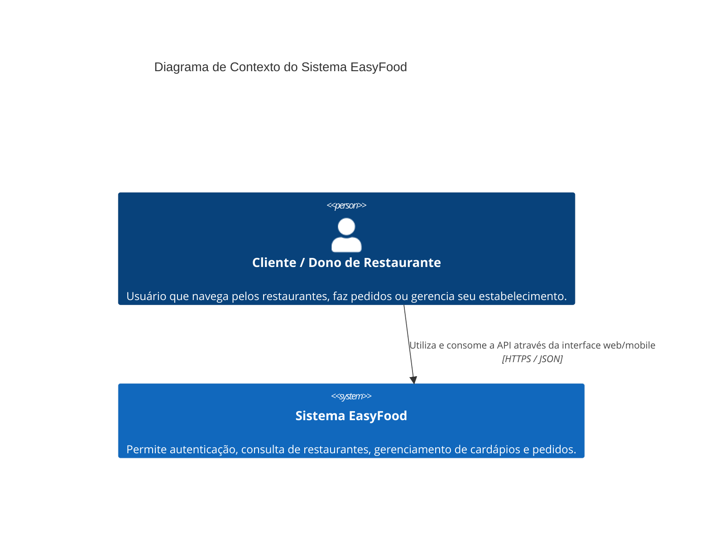
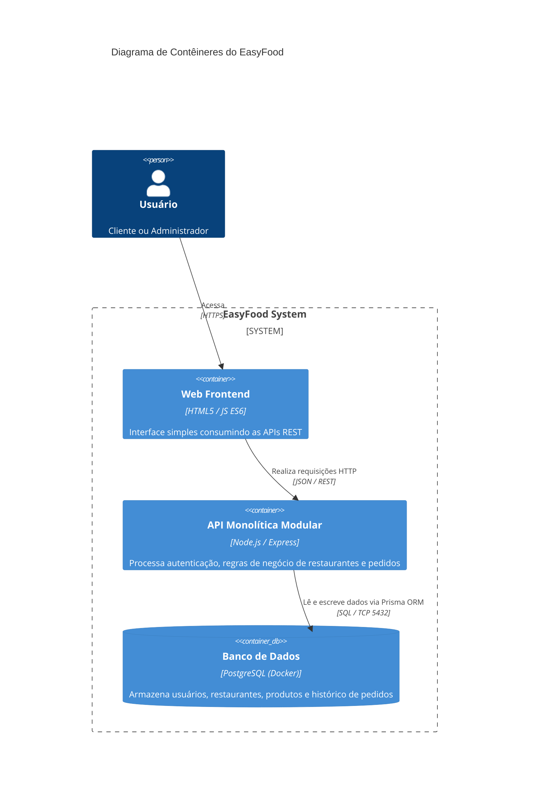
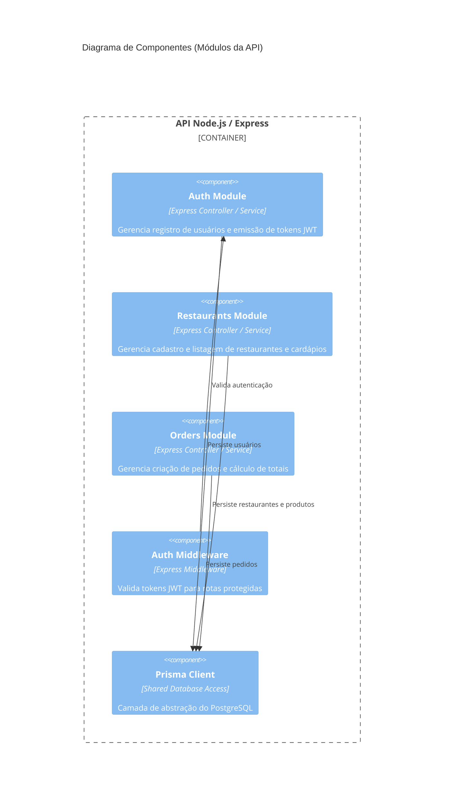

# Diagramas C4 - EasyFood

## Nível 1: Diagrama de Contexto

```mermaid
C4Context
    title Diagrama de Contexto do Sistema EasyFood

    Person(customer, "Cliente / Dono de Restaurante", "Usuário que navega pelos restaurantes, faz pedidos ou gerencia seu estabelecimento.")
    System(easyfood, "Sistema EasyFood", "Permite autenticação, consulta de restaurantes, gerenciamento de cardápios e pedidos.")

    Rel(customer, easyfood, "Utiliza e consome a API através da interface web/mobile", "HTTPS / JSON")
```

## Nível 2: Diagrama de Contêineres

```mermaid
C4Container
    title Diagrama de Contêineres do EasyFood

    Person(user, "Usuário", "Cliente ou Administrador")
    
    System_Boundary(c1, "EasyFood System") {
        Container(web, "Web Frontend", "HTML5 / JS ES6", "Interface simples consumindo as APIs REST")
        Container(api, "API Monolítica Modular", "Node.js / Express", "Processa autenticação, regras de negócio de restaurantes e pedidos")
        ContainerDb(db, "Banco de Dados", "PostgreSQL (Docker)", "Armazena usuários, restaurantes, produtos e histórico de pedidos")
    }

    Rel(user, web, "Acessa", "HTTPS")
    Rel(web, api, "Realiza requisições HTTP", "JSON / REST")
    Rel(api, db, "Lê e escreve dados via Prisma ORM", "SQL / TCP 5432")
```

## Nível 3: Diagrama de Componentes (API Monolítica)

```mermaid
C4Component
    title Diagrama de Componentes (Módulos da API)

    Container_Boundary(api_boundary, "API Node.js / Express") {
        Component(auth_mod, "Auth Module", "Express Controller / Service", "Gerencia registro de usuários e emissão de tokens JWT")
        Component(rest_mod, "Restaurants Module", "Express Controller / Service", "Gerencia cadastro e listagem de restaurantes e cardápios")
        Component(order_mod, "Orders Module", "Express Controller / Service", "Gerencia criação de pedidos e cálculo de totais")
        Component(middleware, "Auth Middleware", "Express Middleware", "Valida tokens JWT para rotas protegidas")
        Component(prisma_client, "Prisma Client", "Shared Database Access", "Camada de abstração do PostgreSQL")
    }

    Rel(auth_mod, prisma_client, "Persiste usuários")
    Rel(rest_mod, prisma_client, "Persiste restaurantes e produtos")
    Rel(order_mod, prisma_client, "Persiste pedidos")
    Rel(middleware, auth_mod, "Valida autenticação")
```